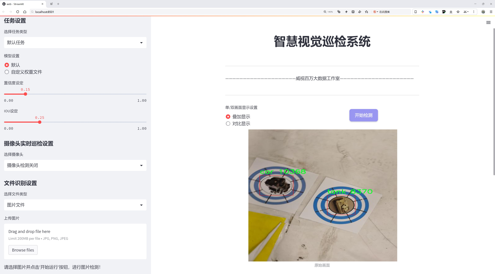
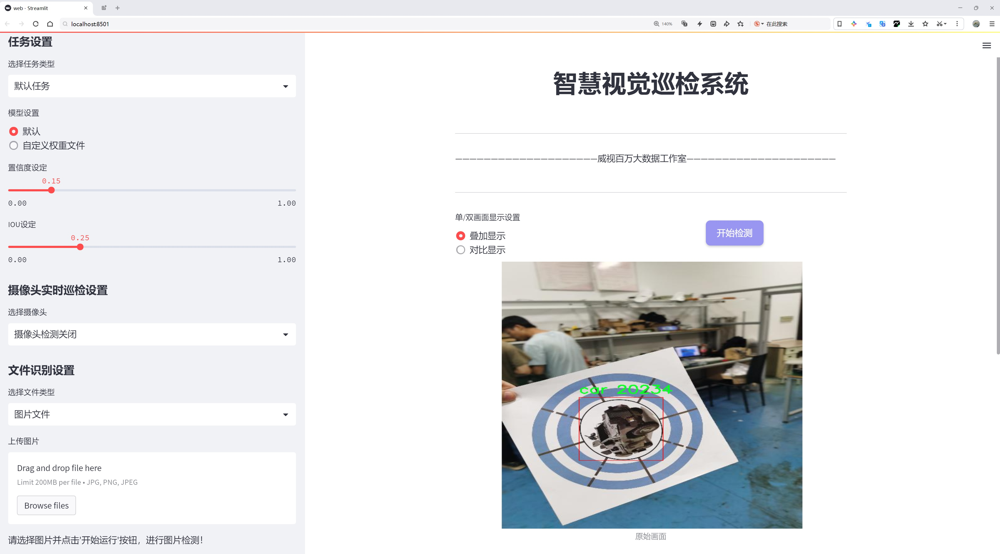
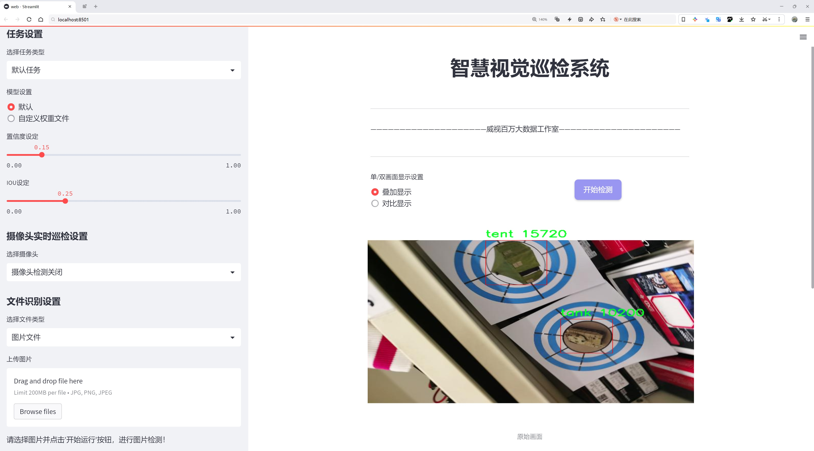
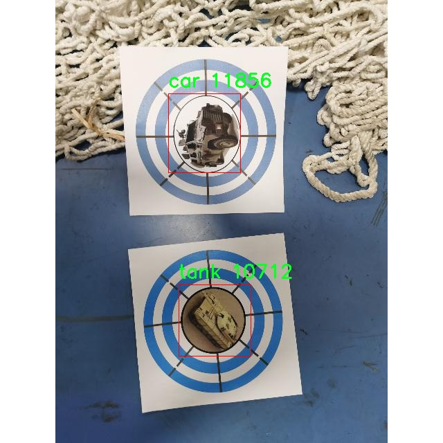
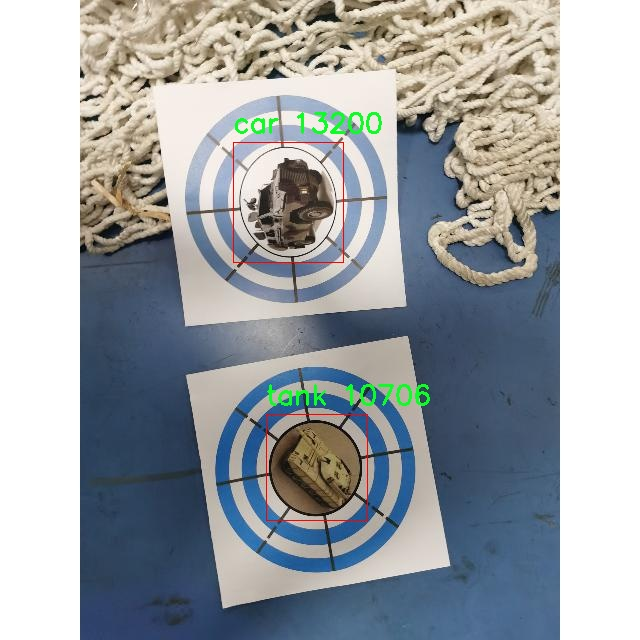
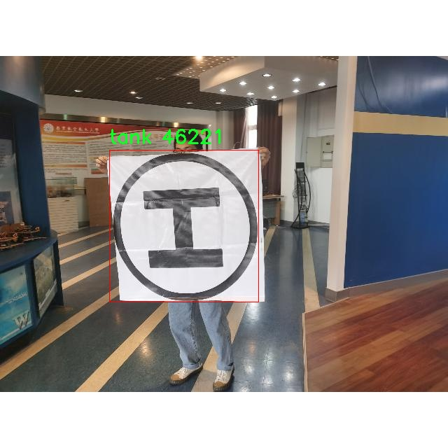
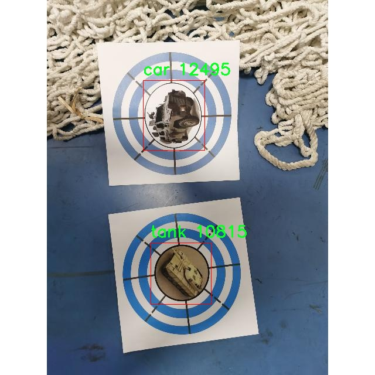
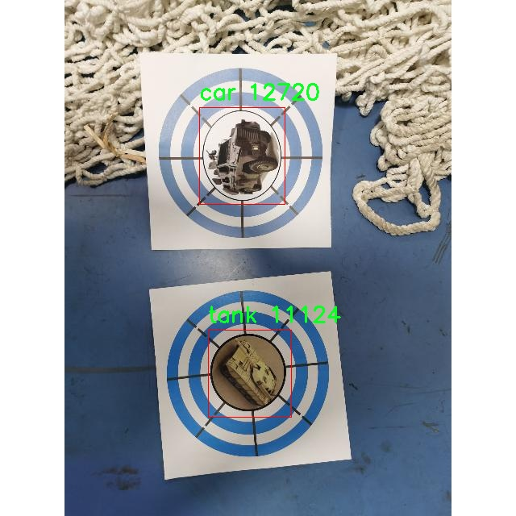

# 模拟军事目标检测检测系统源码分享
 # [一条龙教学YOLOV8标注好的数据集一键训练_70+全套改进创新点发刊_Web前端展示]

### 1.研究背景与意义

项目参考[AAAI Association for the Advancement of Artificial Intelligence](https://gitee.com/qunshansj/projects)

项目来源[AACV Association for the Advancement of Computer Vision](https://gitee.com/qunmasj/projects)

研究背景与意义

随着现代战争的不断演变，军事目标的识别与检测技术日益成为军事战略和战术决策的重要组成部分。传统的目标检测方法在复杂的战场环境中往往面临着准确性不足、实时性差等问题。因此，基于深度学习的目标检测技术，尤其是YOLO（You Only Look Once）系列模型的迅速发展，为军事目标检测提供了新的解决方案。YOLOv8作为该系列的最新版本，凭借其高效的检测速度和优越的准确性，成为了研究者们关注的焦点。

在军事应用中，目标检测不仅需要高精度的识别能力，还要求系统具备良好的实时处理能力，以应对动态变化的战场环境。针对这一需求，改进YOLOv8模型的研究显得尤为重要。通过对YOLOv8的结构进行优化，结合先进的算法和技术，可以显著提升其在复杂场景下的目标检测性能，从而为军事决策提供更为可靠的数据支持。

本研究所使用的数据集“jisai_datasets”包含1800幅图像，涵盖了6个类别的军事目标，包括桥梁、掩体、车辆、土地、坦克和帐篷。这些类别不仅具有代表性，而且在实际军事行动中经常出现，构成了战场环境中关键的目标元素。通过对这些目标的有效检测，能够帮助军事指挥官快速获取战场态势，制定相应的战术策略。

在数据集的构建过程中，图像的多样性和复杂性是关键因素。不同的天气条件、光照变化以及背景干扰都会对目标检测的效果产生影响。因此，本研究将着重探讨如何通过数据增强技术，提升模型在各种环境下的鲁棒性。此外，针对不同类别目标的特征差异，研究将通过改进网络结构和损失函数，增强模型对特定目标的检测能力。

本研究的意义不仅在于提升军事目标检测的技术水平，更在于为未来的军事智能化发展提供理论支持和实践依据。随着人工智能技术的不断进步，军事领域的智能化、自动化程度将进一步提高，目标检测技术将成为其中不可或缺的一部分。通过对改进YOLOv8模型的深入研究，能够为军事智能化系统的构建奠定基础，推动相关技术的应用与发展。

综上所述，基于改进YOLOv8的模拟军事目标检测系统的研究，不仅具有重要的学术价值，也为实际军事应用提供了新的思路和方法。随着研究的深入，期望能够为军事领域的智能化转型贡献力量，提升现代战争中的信息获取和决策能力，从而在复杂多变的战场环境中实现更高效的作战效果。

### 2.图片演示







##### 注意：由于此博客编辑较早，上面“2.图片演示”和“3.视频演示”展示的系统图片或者视频可能为老版本，新版本在老版本的基础上升级如下：（实际效果以升级的新版本为准）

  （1）适配了YOLOV8的“目标检测”模型和“实例分割”模型，通过加载相应的权重（.pt）文件即可自适应加载模型。

  （2）支持“图片识别”、“视频识别”、“摄像头实时识别”三种识别模式。

  （3）支持“图片识别”、“视频识别”、“摄像头实时识别”三种识别结果保存导出，解决手动导出（容易卡顿出现爆内存）存在的问题，识别完自动保存结果并导出到tempDir中。

  （4）支持Web前端系统中的标题、背景图等自定义修改，后面提供修改教程。

  另外本项目提供训练的数据集和训练教程,暂不提供权重文件（best.pt）,需要您按照教程进行训练后实现图片演示和Web前端界面演示的效果。

### 3.视频演示

[3.1 视频演示](https://www.bilibili.com/video/BV1QJt7ecEGU/)

### 4.数据集信息展示

##### 4.1 本项目数据集详细数据（类别数＆类别名）

nc: 6
names: ['bridge', 'bunker', 'car', 'land', 'tank', 'tent']


##### 4.2 本项目数据集信息介绍

数据集信息展示

在本研究中，我们采用了名为“jisai_datasets”的数据集，以训练和改进YOLOv8模型，旨在提升模拟军事目标检测系统的性能。该数据集专门设计用于识别和分类与军事相关的目标，涵盖了六个主要类别，分别为桥梁、掩体、汽车、陆地、坦克和帐篷。这些类别的选择不仅反映了现代军事行动中常见的目标类型，也为模型的训练提供了丰富的样本，确保其在复杂环境中的有效性和准确性。

“jisai_datasets”数据集的类别数量为六，具体类别包括：桥梁、掩体、汽车、陆地、坦克和帐篷。每个类别都代表了特定的军事目标，具有不同的特征和外观。桥梁通常用于军事运输和战略部署，掩体则是士兵隐蔽和防御的重要设施；汽车在军事行动中承担着机动和补给的任务，而坦克则是陆战中的重型装备，具有强大的火力和防护能力。帐篷则多用于临时驻扎和指挥所的搭建。这些类别的多样性使得数据集在训练过程中能够涵盖广泛的场景和条件，增强模型的泛化能力。

在数据集的构建过程中，特别注重了样本的多样性和真实性。每个类别的样本均来自于真实的军事环境，确保模型能够在实际应用中有效识别和分类目标。此外，数据集中的图像涵盖了不同的天气条件、光照变化和视角，进一步增强了模型的鲁棒性。这种多样化的训练数据对于提升YOLOv8在复杂场景下的检测精度至关重要，尤其是在军事行动中，目标的识别往往受到环境因素的影响。

为了确保数据集的高质量和准确性，所有样本均经过严格的标注和审核。每个图像中的目标均以边界框的形式进行标注，确保模型在训练过程中能够学习到目标的精确位置和形状。这种精细的标注方式不仅提高了模型的训练效率，也为后续的性能评估提供了可靠的依据。

在模型训练过程中，我们将“jisai_datasets”数据集与YOLOv8的先进算法相结合，利用其强大的特征提取和目标检测能力，力求在模拟军事目标检测系统中实现更高的准确率和更快的检测速度。通过对数据集的深入分析和优化，我们期望能够克服传统目标检测方法在复杂军事环境中的局限性，为未来的军事行动提供更为精准和高效的技术支持。

总之，“jisai_datasets”作为本研究的核心数据集，凭借其丰富的类别和高质量的样本，为改进YOLOv8模型提供了坚实的基础。通过对该数据集的有效利用，我们期望能够在模拟军事目标检测领域取得显著的进展，为相关技术的发展贡献力量。











### 5.全套项目环境部署视频教程（零基础手把手教学）

[5.1 环境部署教程链接（零基础手把手教学）](https://www.ixigua.com/7404473917358506534?logTag=c807d0cbc21c0ef59de5)


[5.2 安装Python虚拟环境创建和依赖库安装视频教程链接（零基础手把手教学）](https://www.ixigua.com/7404474678003106304?logTag=1f1041108cd1f708b01a)

### 6.手把手YOLOV8训练视频教程（零基础小白有手就能学会）

[6.1 手把手YOLOV8训练视频教程（零基础小白有手就能学会）](https://www.ixigua.com/7404477157818401292?logTag=d31a2dfd1983c9668658)

### 7.70+种全套YOLOV8创新点代码加载调参视频教程（一键加载写好的改进模型的配置文件）

[7.1 70+种全套YOLOV8创新点代码加载调参视频教程（一键加载写好的改进模型的配置文件）](https://www.ixigua.com/7404478314661806627?logTag=29066f8288e3f4eea3a4)

### 8.70+种全套YOLOV8创新点原理讲解（非科班也可以轻松写刊发刊，V10版本正在科研待更新）

由于篇幅限制，每个创新点的具体原理讲解就不一一展开，具体见下列网址中的创新点对应子项目的技术原理博客网址【Blog】：


[8.1 70+种全套YOLOV8创新点原理讲解链接](https://gitee.com/qunmasj/good)

### 9.系统功能展示（检测对象为举例，实际内容以本项目数据集为准）

图9.1.系统支持检测结果表格显示

  图9.2.系统支持置信度和IOU阈值手动调节

  图9.3.系统支持自定义加载权重文件best.pt(需要你通过步骤5中训练获得)

  图9.4.系统支持摄像头实时识别

  图9.5.系统支持图片识别

  图9.6.系统支持视频识别

  图9.7.系统支持识别结果文件自动保存

  图9.8.系统支持Excel导出检测结果数据


### 10.原始YOLOV8算法原理

原始YOLOv8算法原理

YOLOv8是Ultralytics于2023年1月发布的最新目标检测模型，它在YOLO系列的基础上，结合了YOLOX、YOLOv6、YOLOv7和PPYOLOE等前沿算法的设计理念，尤其在头部标签分配和损失计算方面与PP-YOLOE有着显著的相似性。通过整合这些先进的设计，YOLOv8在实时目标检测领域达到了新的高度，凭借其高精度和快速响应的特点，预示着目标检测技术将迎来新的变革。

YOLOv8的网络结构分为四个主要部分：输入端、骨干网络、颈部网络和头部网络。输入端的设计考虑了数据增强的多样性，包括马赛克数据增强、自适应锚框计算和自适应灰度填充。这些增强手段旨在提高模型对不同场景的适应能力，增强模型的泛化性能。骨干网络则采用了Conv.C2f和SPPF（Spatial Pyramid Pooling Fusion）结构，其中C2f模块通过引入更多的分支和跨层连接，极大地丰富了梯度流，使得特征学习更加高效。这一模块的设计灵感来源于YOLOv7的ELAN结构，旨在提升模型的特征表示能力。

颈部网络使用了路径聚合网络（PAN），其主要功能是增强网络对不同尺度对象的特征融合能力。PAN通过对特征图的多层次处理，确保了在目标检测过程中能够有效地整合来自不同层次的信息，从而提高对小目标和大目标的检测精度。头部网络则将分类和检测过程进行了有效的解耦，主要包括损失计算和目标检测框的筛选。在这一部分，YOLOv8采用了Task-Aligned Assigner分配策略，通过加权分类与回归的分数来选择正样本，从而优化了正负样本的分配。

在损失计算方面，YOLOv8引入了二元交叉熵损失（BCELoss）作为分类损失，结合分布焦点损失（DFLoss）和完全交并比损失（CIOULoss）作为回归损失。这种损失函数的组合使得模型在边界框预测的准确性上得到了显著提升，尤其是在复杂场景下的目标检测任务中，能够有效降低误检和漏检的概率。

与前一代YOLO版本相比，YOLOv8在多个方面进行了创新和改进。首先，新的骨干网络和头部网络设计使得YOLOv8在特征提取和目标检测的效率上得到了显著提升。具体而言，YOLOv8将YOLOv5中的C3结构替换为更为丰富的C2f结构，减少了模型的复杂性，同时保持了高效的特征学习能力。此外，YOLOv8在头部网络中采用了解耦合结构，分类和检测头的分离设计不仅提升了模型的灵活性，也使得无锚框检测头的引入减少了锚框预测的数量，从而加速了非最大抑制（NMS）过程，进一步提高了检测速度。

YOLOv8还在训练阶段进行了优化，特别是在数据增强策略上，借鉴了YOLOvX中的做法，在训练的最后10个epoch中关闭马赛克增强，并使用动态Task-Aligned Assigner样本分配策略，以提高模型的训练效率和检测精度。这些改进使得YOLOv8在不同应用场景下都能展现出优异的性能，尤其是在实时检测需求较高的任务中，能够快速响应并提供准确的检测结果。

综上所述，YOLOv8通过引入先进的网络结构和优化的训练策略，在目标检测领域实现了新的突破。其高效的特征提取能力、灵活的模型设计以及精确的损失计算方法，使得YOLOv8在实时检测任务中具备了强大的竞争力。未来，YOLOv8的应用前景广阔，尤其是在农业自动化、智能监控和无人驾驶等领域，能够为相关技术的发展提供强有力的支持。通过将YOLOv8应用于苹果采摘等具体场景，结合其他算法如蚁群算法进行路径规划，将进一步推动农业自动化的进程，提升生产效率，减少人力成本。


### 11.项目核心源码讲解（再也不用担心看不懂代码逻辑）

#### 11.1 ui.py

以下是对给定代码的核心部分进行提炼和详细注释的版本：

```python
import sys
import subprocess

def run_script(script_path):
    """
    使用当前 Python 环境运行指定的脚本。

    Args:
        script_path (str): 要运行的脚本路径

    Returns:
        None
    """
    # 获取当前 Python 解释器的路径
    python_path = sys.executable

    # 构建运行命令，使用 streamlit 运行指定的脚本
    command = f'"{python_path}" -m streamlit run "{script_path}"'

    # 执行命令
    result = subprocess.run(command, shell=True)
    
    # 检查命令执行的返回码，若不为0则表示出错
    if result.returncode != 0:
        print("脚本运行出错。")

# 主程序入口
if __name__ == "__main__":
    # 指定要运行的脚本路径
    script_path = "web.py"  # 这里假设脚本在当前目录下

    # 调用函数运行脚本
    run_script(script_path)
```

### 代码分析与注释

1. **导入模块**：
   - `sys`：用于访问与 Python 解释器紧密相关的变量和函数。
   - `subprocess`：用于执行外部命令和程序。

2. **`run_script` 函数**：
   - **功能**：该函数接收一个脚本路径，并使用当前 Python 环境来运行该脚本。
   - **参数**：
     - `script_path`：要运行的 Python 脚本的路径。
   - **实现步骤**：
     - 使用 `sys.executable` 获取当前 Python 解释器的路径。
     - 构建一个命令字符串，该命令使用 `streamlit` 模块来运行指定的脚本。
     - 使用 `subprocess.run` 执行构建的命令，并通过 `shell=True` 允许在 shell 中执行。
     - 检查命令的返回码，如果返回码不为0，表示脚本运行出错，并打印错误信息。

3. **主程序入口**：
   - 使用 `if __name__ == "__main__":` 确保只有在直接运行该脚本时才会执行以下代码。
   - 指定要运行的脚本路径为 `web.py`，假设该脚本位于当前工作目录。
   - 调用 `run_script` 函数，传入脚本路径以执行该脚本。

### 总结
该代码的核心功能是运行一个指定的 Python 脚本，使用 `streamlit` 模块来启动一个 Web 应用。通过 subprocess 模块，它能够在当前 Python 环境中执行外部命令，并处理可能出现的错误。

这个程序文件 `ui.py` 的主要功能是运行一个指定的 Python 脚本，具体来说是通过 Streamlit 框架来启动一个 Web 应用。程序的结构比较简单，主要由几个部分组成。

首先，文件引入了一些必要的模块，包括 `sys`、`os` 和 `subprocess`。`sys` 模块用于访问与 Python 解释器相关的变量和函数，`os` 模块提供了与操作系统交互的功能，而 `subprocess` 模块则用于在 Python 中执行外部命令。

接下来，程序定义了一个名为 `run_script` 的函数，该函数接受一个参数 `script_path`，表示要运行的脚本的路径。在函数内部，首先获取当前 Python 解释器的路径，这通过 `sys.executable` 实现。然后，构建一个命令字符串，该命令用于通过 Streamlit 运行指定的脚本。命令的格式是 `"{python_path}" -m streamlit run "{script_path}"`，其中 `python_path` 是当前 Python 解释器的路径，`script_path` 是传入的脚本路径。

接着，使用 `subprocess.run` 方法执行构建好的命令。该方法会在一个新的 shell 中运行命令，并等待其完成。如果命令执行的返回码不为 0，表示脚本运行出错，程序会打印出相应的错误信息。

最后，程序的主入口部分使用 `if __name__ == "__main__":` 来确保只有在直接运行该脚本时才会执行其中的代码。在这里，首先调用 `abs_path` 函数获取名为 `web.py` 的脚本的绝对路径，然后调用 `run_script` 函数来运行这个脚本。

总的来说，这个文件的功能是通过 Streamlit 框架启动一个 Web 应用，具体实现是通过调用外部命令来运行指定的 Python 脚本。

#### 11.2 code\ultralytics\engine\validator.py

以下是代码中最核心的部分，并附上详细的中文注释：

```python
class BaseValidator:
    """
    BaseValidator类用于创建验证器的基类。

    属性:
        args (SimpleNamespace): 验证器的配置。
        dataloader (DataLoader): 用于验证的数据加载器。
        model (nn.Module): 要验证的模型。
        device (torch.device): 用于验证的设备。
        speed (dict): 包含预处理、推理、损失和后处理的速度信息。
        save_dir (Path): 保存结果的目录。
    """

    def __init__(self, dataloader=None, save_dir=None, args=None):
        """
        初始化BaseValidator实例。

        参数:
            dataloader (torch.utils.data.DataLoader): 用于验证的数据加载器。
            save_dir (Path, optional): 保存结果的目录。
            args (SimpleNamespace): 验证器的配置。
        """
        self.args = get_cfg(overrides=args)  # 获取配置
        self.dataloader = dataloader  # 数据加载器
        self.device = None  # 设备初始化
        self.save_dir = save_dir or get_save_dir(self.args)  # 保存目录
        self.speed = {"preprocess": 0.0, "inference": 0.0, "loss": 0.0, "postprocess": 0.0}  # 速度字典

    @smart_inference_mode()
    def __call__(self, model=None):
        """执行验证过程。"""
        self.device = select_device(self.args.device)  # 选择设备
        model = AutoBackend(model or self.args.model, device=self.device)  # 初始化模型
        model.eval()  # 设置模型为评估模式

        bar = TQDM(self.dataloader, desc="验证中", total=len(self.dataloader))  # 进度条
        for batch_i, batch in enumerate(bar):
            # 预处理
            batch = self.preprocess(batch)

            # 推理
            preds = model(batch["img"])  # 获取模型预测结果

            # 更新指标
            self.update_metrics(preds, batch)

        stats = self.get_stats()  # 获取统计信息
        self.print_results()  # 打印结果
        return stats  # 返回统计信息

    def preprocess(self, batch):
        """对输入批次进行预处理。"""
        return batch  # 这里可以添加具体的预处理逻辑

    def update_metrics(self, preds, batch):
        """根据预测结果和批次更新指标。"""
        pass  # 这里可以添加更新指标的逻辑

    def get_stats(self):
        """返回模型性能的统计信息。"""
        return {}  # 这里可以返回具体的统计信息

    def print_results(self):
        """打印模型预测的结果。"""
        pass  # 这里可以添加打印结果的逻辑
```

### 代码核心部分说明：
1. **BaseValidator类**：这是一个基类，用于实现模型验证的基本功能。它包含了模型验证所需的配置、数据加载器、设备选择等基本属性和方法。

2. **初始化方法**：在初始化时，获取配置、设置数据加载器和保存目录，并初始化速度字典。

3. **__call__方法**：这是执行验证的主要方法。它选择设备，初始化模型，并通过进度条遍历数据加载器，对每个批次进行预处理、推理和指标更新。

4. **预处理、更新指标和获取统计信息的方法**：这些方法提供了对输入数据的预处理、更新模型性能指标和获取统计信息的接口，具体实现可以根据需求进行扩展。

通过这些核心部分，`BaseValidator`类能够实现对模型的验证过程，并为具体的验证实现提供基础。

这个程序文件是一个用于验证模型准确性的基类，主要用于YOLO（You Only Look Once）系列模型的验证过程。文件的主要功能是通过加载数据集、执行推理、计算损失和更新指标等步骤，来评估模型在测试集或验证集上的表现。

首先，文件中定义了一个`BaseValidator`类，该类包含了进行模型验证所需的各种属性和方法。类的构造函数`__init__`接收数据加载器、保存目录、进度条、配置参数和回调函数等参数，并初始化相关属性。特别地，它会检查输入图像的大小，并确保保存结果的目录存在。

在调用`__call__`方法时，验证器会根据是否传入训练器或模型来决定验证的模式。如果是在训练过程中，它会使用训练器中的模型和数据，并设置相应的设备和数据处理方式；如果是在推理模式下，它会加载指定的模型并准备数据集。

验证过程的核心在于循环遍历数据加载器中的每个批次。在每个批次中，程序会执行以下步骤：预处理输入数据、进行推理以获取预测结果、计算损失（如果在训练模式下）、后处理预测结果并更新性能指标。此外，程序还会根据需要绘制验证样本和预测结果。

在验证结束后，程序会计算并打印模型的性能统计信息，包括每个步骤的处理时间。如果设置了保存JSON结果的选项，程序会将预测结果保存到指定的文件中。

该类还提供了一些辅助方法，例如匹配预测结果与真实标签、添加和运行回调函数、初始化和更新性能指标等。通过这些方法，用户可以扩展和定制验证过程，以满足特定需求。

总的来说，这个文件是YOLO模型验证过程的核心部分，负责处理数据、执行推理和评估模型性能，为用户提供了一个灵活的框架来验证和分析模型的表现。

#### 11.3 70+种YOLOv8算法改进源码大全和调试加载训练教程（非必要）\ultralytics\utils\ops.py

以下是代码中最核心的部分，并附上详细的中文注释：

```python
import torch
import torchvision

def non_max_suppression(
        prediction,
        conf_thres=0.25,
        iou_thres=0.45,
        classes=None,
        agnostic=False,
        multi_label=False,
        labels=(),
        max_det=300,
        nc=0,  # 类别数量（可选）
        max_time_img=0.05,
        max_nms=30000,
        max_wh=7680,
):
    """
    对一组边界框执行非最大抑制（NMS），支持掩码和每个框多个标签。

    参数：
        prediction (torch.Tensor): 形状为 (batch_size, num_classes + 4 + num_masks, num_boxes) 的张量，
            包含预测的框、类别和掩码。张量应符合模型输出格式，例如 YOLO。
        conf_thres (float): 置信度阈值，低于该值的框将被过滤掉。
        iou_thres (float): IoU 阈值，低于该值的框在 NMS 过程中将被过滤掉。
        classes (List[int]): 要考虑的类别索引列表。如果为 None，则考虑所有类别。
        agnostic (bool): 如果为 True，模型对类别数量不敏感，所有类别将被视为一个。
        multi_label (bool): 如果为 True，每个框可能有多个标签。
        labels (List[List[Union[int, float, torch.Tensor]]]): 每个图像的先验标签列表。
        max_det (int): NMS 后要保留的最大框数量。
        nc (int, optional): 模型输出的类别数量。任何超出此范围的索引将被视为掩码。
        max_time_img (float): 处理一张图像的最大时间（秒）。
        max_nms (int): 传递给 torchvision.ops.nms() 的最大框数量。
        max_wh (int): 最大框宽度和高度（像素）。

    返回：
        (List[torch.Tensor]): 长度为 batch_size 的列表，每个元素是形状为 (num_boxes, 6 + num_masks) 的张量，
            包含保留的框，列为 (x1, y1, x2, y2, confidence, class, mask1, mask2, ...)。
    """

    # 检查置信度和IoU阈值的有效性
    assert 0 <= conf_thres <= 1, f'无效的置信度阈值 {conf_thres}, 有效值在 0.0 和 1.0 之间'
    assert 0 <= iou_thres <= 1, f'无效的 IoU {iou_thres}, 有效值在 0.0 和 1.0 之间'
    
    # 如果预测结果是列表或元组（YOLOv8模型在验证模式下，输出为(inference_out, loss_out)）
    if isinstance(prediction, (list, tuple)):
        prediction = prediction[0]  # 选择仅推理输出

    device = prediction.device  # 获取设备信息
    bs = prediction.shape[0]  # 批量大小
    nc = nc or (prediction.shape[1] - 4)  # 类别数量
    nm = prediction.shape[1] - nc - 4  # 掩码数量
    mi = 4 + nc  # 掩码起始索引
    xc = prediction[:, 4:mi].amax(1) > conf_thres  # 置信度候选框

    # 设置时间限制
    time_limit = 0.5 + max_time_img * bs  # 超过此时间限制将退出处理

    # 转置预测结果
    prediction = prediction.transpose(-1, -2)  # 形状从(1,84,6300)变为(1,6300,84)
    prediction[..., :4] = xywh2xyxy(prediction[..., :4])  # 将xywh格式转换为xyxy格式

    output = [torch.zeros((0, 6 + nm), device=prediction.device)] * bs  # 初始化输出
    for xi, x in enumerate(prediction):  # 遍历每张图像的推理结果
        x = x[xc[xi]]  # 根据置信度筛选框

        # 如果没有剩余框，处理下一张图像
        if not x.shape[0]:
            continue

        # 分离边界框、类别和掩码
        box, cls, mask = x.split((4, nc, nm), 1)

        # 处理多标签情况
        if multi_label:
            i, j = torch.where(cls > conf_thres)  # 获取满足置信度的索引
            x = torch.cat((box[i], x[i, 4 + j, None], j[:, None].float(), mask[i]), 1)
        else:  # 仅保留最佳类别
            conf, j = cls.max(1, keepdim=True)
            x = torch.cat((box, conf, j.float(), mask), 1)[conf.view(-1) > conf_thres]

        # 按类别过滤
        if classes is not None:
            x = x[(x[:, 5:6] == torch.tensor(classes, device=x.device)).any(1)]

        n = x.shape[0]  # 当前框的数量
        if not n:  # 如果没有框，继续处理下一张图像
            continue
        if n > max_nms:  # 如果框的数量超过最大限制，按置信度排序并去除多余框
            x = x[x[:, 4].argsort(descending=True)[:max_nms]]

        # 执行批量NMS
        c = x[:, 5:6] * (0 if agnostic else max_wh)  # 类别偏移
        boxes, scores = x[:, :4] + c, x[:, 4]  # 计算框和分数
        i = torchvision.ops.nms(boxes, scores, iou_thres)  # 进行NMS
        i = i[:max_det]  # 限制检测框数量

        output[xi] = x[i]  # 保存当前图像的输出
        if (time.time() - t) > time_limit:  # 检查时间限制
            break  # 超过时间限制，退出

    return output  # 返回最终的检测结果
```

### 代码核心部分说明：
1. **非最大抑制（NMS）**：该函数用于从多个重叠的边界框中选择最佳框，通常用于目标检测任务，以减少冗余检测。
2. **参数说明**：函数接收多个参数，包括预测结果、置信度阈值、IoU阈值、类别等，允许用户自定义检测的行为。
3. **框的筛选**：通过置信度和类别进行筛选，确保最终输出的框具有较高的置信度和正确的类别。
4. **时间限制**：为了提高效率，设置了处理每张图像的最大时间限制，避免处理时间过长。
5. **输出格式**：最终返回的结果为每张图像的检测框，包括位置、置信度和类别信息。

这个程序文件是一个用于YOLOv8算法的工具类，主要包含了一些图像处理和目标检测相关的功能。代码中定义了多个函数和一个上下文管理器类，具体功能如下：

首先，`Profile`类是一个性能分析工具，可以用作装饰器或上下文管理器来测量代码块的执行时间。通过`__enter__`和`__exit__`方法，用户可以轻松地记录代码的运行时间，方便调试和优化。

接下来，`segment2box`函数将分割标签转换为边界框标签，确保边界框在图像内部。它接收一个分割标签和图像的宽高，返回一个包含最小和最大x、y值的数组。

`scale_boxes`函数用于将边界框从一个图像的尺寸缩放到另一个图像的尺寸。它考虑了图像的比例和填充情况，确保边界框在新图像中正确定位。

`make_divisible`函数用于将一个数字调整为最接近的可被指定除数整除的数，常用于调整网络层的输出尺寸。

`non_max_suppression`函数实现了非极大值抑制（NMS），用于过滤重叠的边界框，保留置信度高的框。该函数支持多标签和掩码，并允许用户设置置信度阈值和IoU阈值。

`clip_boxes`和`clip_coords`函数用于将边界框和坐标限制在图像的边界内，防止超出图像范围。

`scale_image`函数将掩码调整为原始图像的大小，确保掩码与图像的尺寸一致。

`xyxy2xywh`和`xywh2xyxy`函数用于在不同的边界框表示格式之间转换，分别是从(x1, y1, x2, y2)到(x, y, width, height)和反向转换。

`masks2segments`函数将掩码转换为分段，支持选择最大的分段或连接所有分段。

`convert_torch2numpy_batch`函数将一个批次的Torch张量转换为NumPy数组，便于后续处理。

最后，`clean_str`函数用于清理字符串，替换特殊字符为下划线，确保字符串的规范性。

整体来看，这个文件提供了YOLOv8模型在目标检测任务中所需的多种工具函数，涵盖了从图像预处理到后处理的各个环节，方便开发者进行模型的训练和推理。

#### 11.4 code\ultralytics\solutions\ai_gym.py

以下是经过简化和注释的核心代码部分：

```python
import cv2
from ultralytics.utils.checks import check_imshow
from ultralytics.utils.plotting import Annotator

class AIGym:
    """用于管理实时视频流中人们根据姿势进行的健身步骤的类。"""

    def __init__(self):
        """初始化AIGym，设置视觉和图像参数的默认值。"""
        self.im0 = None  # 当前帧图像
        self.tf = None   # 线条厚度
        self.keypoints = None  # 关键点数据
        self.poseup_angle = None  # 上升姿势的角度阈值
        self.posedown_angle = None  # 下降姿势的角度阈值
        self.threshold = 0.001  # 阈值，用于判断姿势变化
        self.angle = None  # 存储当前角度
        self.count = None  # 存储计数
        self.stage = None  # 存储当前阶段
        self.pose_type = "pushup"  # 姿势类型，默认为俯卧撑
        self.kpts_to_check = None  # 需要检查的关键点
        self.view_img = False  # 是否显示图像
        self.annotator = None  # 用于绘制的Annotator对象
        self.env_check = check_imshow(warn=True)  # 检查环境是否支持imshow

    def set_args(self, kpts_to_check, line_thickness=2, view_img=False, pose_up_angle=145.0, pose_down_angle=90.0, pose_type="pullup"):
        """
        配置AIGym的参数
        Args:
            kpts_to_check (list): 用于计数的3个关键点
            line_thickness (int): 边界框的线条厚度
            view_img (bool): 是否显示图像
            pose_up_angle (float): 设置上升姿势的角度
            pose_down_angle (float): 设置下降姿势的角度
            pose_type: "pushup", "pullup" 或 "abworkout"
        """
        self.kpts_to_check = kpts_to_check
        self.tf = line_thickness
        self.view_img = view_img
        self.poseup_angle = pose_up_angle
        self.posedown_angle = pose_down_angle
        self.pose_type = pose_type

    def start_counting(self, im0, results, frame_count):
        """
        计数健身步骤的函数
        Args:
            im0 (ndarray): 当前视频流帧
            results: 姿势估计数据
            frame_count: 当前帧计数
        """
        self.im0 = im0  # 更新当前帧图像
        if frame_count == 1:
            # 初始化计数、角度和阶段
            self.count = [0] * len(results[0])
            self.angle = [0] * len(results[0])
            self.stage = ["-" for _ in results[0]]
        
        self.keypoints = results[0].keypoints.data  # 获取关键点数据
        self.annotator = Annotator(im0, line_width=2)  # 创建Annotator对象

        num_keypoints = len(results[0])  # 关键点数量

        # 如果关键点数量变化，调整角度、计数和阶段的大小
        if len(self.angle) != num_keypoints:
            self.angle = [0] * num_keypoints
            self.count = [0] * num_keypoints
            self.stage = ["-" for _ in range(num_keypoints)]

        # 遍历每个关键点，计算角度和更新计数
        for ind, k in enumerate(reversed(self.keypoints)):
            self.angle[ind] = self.annotator.estimate_pose_angle(
                k[int(self.kpts_to_check[0])].cpu(),
                k[int(self.kpts_to_check[1])].cpu(),
                k[int(self.kpts_to_check[2])].cpu(),
            )
            self.im0 = self.annotator.draw_specific_points(k, self.kpts_to_check, shape=(640, 640), radius=10)

            # 根据姿势类型更新阶段和计数
            if self.pose_type == "pushup":
                if self.angle[ind] > self.poseup_angle:
                    self.stage[ind] = "up"
                if self.angle[ind] < self.posedown_angle and self.stage[ind] == "up":
                    self.stage[ind] = "down"
                    self.count[ind] += 1
            
            elif self.pose_type == "pullup":
                if self.angle[ind] > self.poseup_angle:
                    self.stage[ind] = "down"
                if self.angle[ind] < self.posedown_angle and self.stage[ind] == "down":
                    self.stage[ind] = "up"
                    self.count[ind] += 1

            # 绘制角度、计数和阶段信息
            self.annotator.plot_angle_and_count_and_stage(
                angle_text=self.angle[ind],
                count_text=self.count[ind],
                stage_text=self.stage[ind],
                center_kpt=k[int(self.kpts_to_check[1])],
                line_thickness=self.tf,
            )

            self.annotator.kpts(k, shape=(640, 640), radius=1, kpt_line=True)  # 绘制关键点

        # 如果环境支持并且需要显示图像，则显示当前帧
        if self.env_check and self.view_img:
            cv2.imshow("Ultralytics YOLOv8 AI GYM", self.im0)
            if cv2.waitKey(1) & 0xFF == ord("q"):
                return  # 按'q'键退出

        return self.im0  # 返回当前帧图像

if __name__ == "__main__":
    AIGym()  # 创建AIGym实例
```

### 代码说明：
1. **类 `AIGym`**: 该类用于管理实时视频流中健身动作的计数和状态更新。
2. **初始化方法 `__init__`**: 设置了一些默认参数，包括图像、关键点、角度、计数等。
3. **方法 `set_args`**: 用于配置健身动作的相关参数，例如需要检查的关键点、线条厚度、姿势类型等。
4. **方法 `start_counting`**: 这是主要的计数逻辑，接收当前帧图像和姿势估计结果，计算角度、更新计数和阶段，并绘制相应的图像信息。
5. **环境检查**: 通过 `check_imshow` 检查当前环境是否支持图像显示。
6. **显示图像**: 如果设置了显示图像的选项，并且环境支持，则使用 OpenCV 显示当前帧图像。

这个程序文件定义了一个名为 `AIGym` 的类，旨在管理基于姿势的实时视频流中的健身动作计数。程序首先导入了必要的库，包括 OpenCV 和一些来自 `ultralytics` 的工具函数。

在 `AIGym` 类的构造函数 `__init__` 中，初始化了一些默认值，包括图像参数、关键点信息、计数和角度信息等。具体来说，`im0` 用于存储当前帧图像，`tf` 表示线条的厚度，`keypoints` 用于存储关键点数据，`poseup_angle` 和 `posedown_angle` 分别表示姿势向上和向下时的角度阈值，`count` 和 `stage` 用于记录每个动作的计数和当前阶段，`pose_type` 用于指定动作类型（如俯卧撑、引体向上或腹部锻炼）。

`set_args` 方法用于配置 `AIGym` 的参数，包括要检查的关键点、线条厚度、是否显示图像、向上和向下的角度阈值以及动作类型。这个方法允许用户根据需要自定义这些参数。

`start_counting` 方法是主要的计数逻辑，接受当前帧图像、姿势估计结果和帧计数作为输入。该方法首先更新当前帧图像，并在第一次调用时初始化计数、角度和阶段的列表。接着，提取关键点数据，并使用 `Annotator` 类来绘制图像和进行姿势角度的估计。

在这个方法中，程序根据指定的动作类型（如俯卧撑、引体向上或腹部锻炼）来计算角度，并判断当前的动作阶段。通过比较当前角度与设定的阈值，程序能够判断出用户的动作是向上还是向下，并相应地更新计数。每次更新后，程序还会在图像上绘制当前的角度、计数和阶段信息。

最后，如果环境支持图像显示且用户选择了显示图像，程序会使用 OpenCV 显示当前帧图像，并允许用户通过按下 'q' 键退出显示。

在文件的最后部分，包含了一个简单的主程序调用 `AIGym` 类的实例化，表明该类可以直接运行。整体而言，这个程序通过实时视频流和姿势估计技术，为用户提供了一个智能的健身计数工具。

#### 11.5 train.py

以下是经过简化和注释的核心代码部分：

```python
import random
import numpy as np
import torch.nn as nn
from ultralytics.data import build_dataloader, build_yolo_dataset
from ultralytics.engine.trainer import BaseTrainer
from ultralytics.models import yolo
from ultralytics.nn.tasks import DetectionModel
from ultralytics.utils import LOGGER, RANK
from ultralytics.utils.torch_utils import de_parallel, torch_distributed_zero_first

class DetectionTrainer(BaseTrainer):
    """
    扩展自 BaseTrainer 类，用于基于检测模型的训练。
    """

    def build_dataset(self, img_path, mode="train", batch=None):
        """
        构建 YOLO 数据集。

        参数:
            img_path (str): 包含图像的文件夹路径。
            mode (str): 模式，`train` 或 `val`，用户可以为每种模式自定义不同的增强。
            batch (int, optional): 批次大小，适用于 `rect` 模式。默认为 None。
        """
        gs = max(int(de_parallel(self.model).stride.max() if self.model else 0), 32)  # 获取模型的最大步幅
        return build_yolo_dataset(self.args, img_path, batch, self.data, mode=mode, rect=mode == "val", stride=gs)

    def get_dataloader(self, dataset_path, batch_size=16, rank=0, mode="train"):
        """构造并返回数据加载器。"""
        assert mode in ["train", "val"]  # 确保模式有效
        with torch_distributed_zero_first(rank):  # 仅在 DDP 时初始化数据集 *.cache 一次
            dataset = self.build_dataset(dataset_path, mode, batch_size)  # 构建数据集
        shuffle = mode == "train"  # 训练模式下打乱数据
        workers = self.args.workers if mode == "train" else self.args.workers * 2  # 设置工作线程数
        return build_dataloader(dataset, batch_size, workers, shuffle, rank)  # 返回数据加载器

    def preprocess_batch(self, batch):
        """对图像批次进行预处理，包括缩放和转换为浮点数。"""
        batch["img"] = batch["img"].to(self.device, non_blocking=True).float() / 255  # 转换为浮点数并归一化
        if self.args.multi_scale:  # 如果启用多尺度
            imgs = batch["img"]
            sz = (
                random.randrange(self.args.imgsz * 0.5, self.args.imgsz * 1.5 + self.stride)
                // self.stride
                * self.stride
            )  # 随机选择尺寸
            sf = sz / max(imgs.shape[2:])  # 计算缩放因子
            if sf != 1:  # 如果需要缩放
                ns = [
                    math.ceil(x * sf / self.stride) * self.stride for x in imgs.shape[2:]
                ]  # 计算新的形状
                imgs = nn.functional.interpolate(imgs, size=ns, mode="bilinear", align_corners=False)  # 进行插值
            batch["img"] = imgs  # 更新批次图像
        return batch

    def get_model(self, cfg=None, weights=None, verbose=True):
        """返回 YOLO 检测模型。"""
        model = DetectionModel(cfg, nc=self.data["nc"], verbose=verbose and RANK == -1)  # 创建检测模型
        if weights:
            model.load(weights)  # 加载权重
        return model

    def plot_training_samples(self, batch, ni):
        """绘制带有注释的训练样本。"""
        plot_images(
            images=batch["img"],
            batch_idx=batch["batch_idx"],
            cls=batch["cls"].squeeze(-1),
            bboxes=batch["bboxes"],
            paths=batch["im_file"],
            fname=self.save_dir / f"train_batch{ni}.jpg",
            on_plot=self.on_plot,
        )

    def plot_metrics(self):
        """从 CSV 文件绘制指标。"""
        plot_results(file=self.csv, on_plot=self.on_plot)  # 保存结果图
```

### 代码注释说明：
1. **类定义**：`DetectionTrainer` 类继承自 `BaseTrainer`，用于实现 YOLO 模型的训练功能。
2. **构建数据集**：`build_dataset` 方法用于根据给定的图像路径和模式构建 YOLO 数据集，支持训练和验证模式。
3. **获取数据加载器**：`get_dataloader` 方法用于创建数据加载器，确保在分布式训练时只初始化一次数据集。
4. **预处理批次**：`preprocess_batch` 方法对输入的图像批次进行归一化和多尺度处理，确保输入数据适合模型。
5. **获取模型**：`get_model` 方法用于创建 YOLO 检测模型，并可选择性地加载预训练权重。
6. **绘制训练样本**：`plot_training_samples` 方法用于可视化训练样本及其注释，便于调试和分析。
7. **绘制指标**：`plot_metrics` 方法用于从 CSV 文件中提取并绘制训练过程中的指标，帮助监控训练效果。

这个程序文件 `train.py` 是一个用于训练 YOLO（You Only Look Once）目标检测模型的 Python 脚本，继承自 `BaseTrainer` 类。它的主要功能是构建数据集、创建数据加载器、预处理图像批次、设置模型属性、获取模型、进行模型验证、记录损失、输出训练进度、绘制训练样本和指标等。

在文件开头，导入了一些必要的库和模块，包括数学运算、随机数生成、深度学习相关的库（如 PyTorch）以及 YOLO 模型和数据处理的工具。

`DetectionTrainer` 类中定义了多个方法。`build_dataset` 方法用于构建 YOLO 数据集，接受图像路径、模式（训练或验证）和批次大小作为参数。它使用 `build_yolo_dataset` 函数来创建数据集，并根据模式选择不同的增强方式。

`get_dataloader` 方法用于构建数据加载器，确保在分布式训练时只初始化一次数据集。它根据模式设置是否打乱数据，并返回构建好的数据加载器。

`preprocess_batch` 方法负责对图像批次进行预处理，包括将图像缩放到合适的大小并转换为浮点数格式。这个方法还支持多尺度训练，随机选择图像的大小进行训练。

`set_model_attributes` 方法用于设置模型的属性，包括类别数量和类别名称等。这些属性是从数据集中提取的，以确保模型能够正确识别目标。

`get_model` 方法用于返回一个 YOLO 检测模型，可以选择加载预训练权重。

`get_validator` 方法返回一个用于验证 YOLO 模型的验证器，记录损失名称以便后续分析。

`label_loss_items` 方法用于返回带有标签的训练损失项字典，方便监控训练过程中的损失变化。

`progress_string` 方法返回一个格式化的字符串，显示训练进度，包括当前的 epoch、GPU 内存使用情况、损失值、实例数量和图像大小等信息。

`plot_training_samples` 方法用于绘制训练样本及其标注，帮助可视化训练数据的质量。

最后，`plot_metrics` 和 `plot_training_labels` 方法分别用于绘制训练过程中的指标和生成带标签的训练图，帮助分析模型的训练效果。

总体而言，这个脚本为 YOLO 模型的训练提供了全面的支持，包括数据处理、模型构建、训练监控和结果可视化等功能。

#### 11.6 code\ultralytics\hub\__init__.py

以下是经过简化和注释的核心代码部分：

```python
# 导入必要的库
import requests
from ultralytics.hub.auth import Auth
from ultralytics.utils import LOGGER, SETTINGS

def login(api_key: str = None, save=True) -> bool:
    """
    使用提供的API密钥登录Ultralytics HUB API。

    参数:
        api_key (str, optional): 用于身份验证的API密钥。如果未提供，将从SETTINGS或HUB_API_KEY环境变量中获取。
        save (bool, optional): 如果身份验证成功，是否将API密钥保存到SETTINGS中。
    
    返回:
        bool: 如果身份验证成功返回True，否则返回False。
    """
    # 检查必要的库版本
    from hub_sdk import HUBClient

    # 设置API密钥的URL
    api_key_url = "https://hub.ultralytics.com/settings?tab=api+keys"
    saved_key = SETTINGS.get("api_key")  # 从设置中获取已保存的API密钥
    active_key = api_key or saved_key  # 如果提供了api_key，则使用它，否则使用已保存的密钥
    credentials = {"api_key": active_key} if active_key else None  # 设置凭据

    client = HUBClient(credentials)  # 初始化HUBClient

    if client.authenticated:
        # 成功进行身份验证
        if save and client.api_key != saved_key:
            SETTINGS.update({"api_key": client.api_key})  # 更新设置中的API密钥

        # 根据是否提供了密钥设置日志消息
        log_message = "New authentication successful ✅" if client.api_key == api_key or not credentials else "Authenticated ✅"
        LOGGER.info(log_message)  # 记录成功信息

        return True
    else:
        # 身份验证失败
        LOGGER.info(f"Retrieve API key from {api_key_url}")
        return False

def logout():
    """
    从Ultralytics HUB注销，通过从设置文件中移除API密钥。
    """
    SETTINGS["api_key"] = ""  # 清空API密钥
    SETTINGS.save()  # 保存设置
    LOGGER.info("logged out ✅. To log in again, use 'yolo hub login'.")

def reset_model(model_id=""):
    """将训练好的模型重置为未训练状态。"""
    # 向HUB API发送请求以重置模型
    r = requests.post(f"https://hub.ultralytics.com/model-reset", json={"modelId": model_id}, headers={"x-api-key": Auth().api_key})
    if r.status_code == 200:
        LOGGER.info("Model reset successfully")  # 记录成功信息
    else:
        LOGGER.warning(f"Model reset failure {r.status_code} {r.reason}")  # 记录失败信息

def export_model(model_id="", format="torchscript"):
    """将模型导出为指定格式。"""
    # 确保格式是支持的格式
    r = requests.post(
        f"https://hub.ultralytics.com/v1/models/{model_id}/export", json={"format": format}, headers={"x-api-key": Auth().api_key}
    )
    assert r.status_code == 200, f"{format} export failure {r.status_code} {r.reason}"  # 检查导出请求是否成功
    LOGGER.info(f"{format} export started ✅")  # 记录导出开始的信息

def check_dataset(path="", task="detect"):
    """
    在上传之前检查HUB数据集Zip文件的错误。
    
    参数:
        path (str, optional): 数据集Zip文件的路径，默认为''。
        task (str, optional): 数据集任务，默认为'detect'。
    """
    # 检查数据集的有效性
    HUBDatasetStats(path=path, task=task).get_json()
    LOGGER.info("Checks completed correctly ✅. Upload this dataset to https://hub.ultralytics.com/datasets/.")
```

### 代码说明：
1. **login**: 该函数用于登录Ultralytics HUB API，验证API密钥并可选择保存密钥。
2. **logout**: 该函数用于注销，清空存储的API密钥。
3. **reset_model**: 该函数用于重置指定ID的模型，使其回到未训练状态。
4. **export_model**: 该函数用于将模型导出为指定格式，确保格式是支持的。
5. **check_dataset**: 该函数用于检查数据集的有效性，确保在上传之前没有错误。

这个程序文件是Ultralytics YOLO库的一部分，主要用于与Ultralytics HUB进行交互，提供了一些功能，包括登录、登出、模型重置、模型导出、数据集检查等。

首先，文件中定义了一个`login`函数，用于通过提供的API密钥登录Ultralytics HUB API。如果没有提供API密钥，函数会尝试从设置或环境变量中获取。成功认证后，可以选择将API密钥保存到设置中。该函数还会记录认证的结果信息。

接下来是`logout`函数，它用于登出Ultralytics HUB，通过清空设置中的API密钥来实现。用户可以通过调用`hub.logout()`来登出。

`reset_model`函数用于将训练好的模型重置为未训练状态。它通过发送POST请求到HUB API来实现，如果请求成功，会记录重置成功的信息。

`export_fmts_hub`函数返回一个支持的导出格式列表，包含HUB支持的所有导出格式。

`export_model`函数用于将模型导出为指定格式。它会检查所提供的格式是否被支持，并发送请求到HUB API进行导出。如果请求成功，会记录导出开始的信息。

`get_export`函数用于获取已导出的模型字典，包含下载链接。它同样会检查导出格式的有效性，并发送请求到HUB API。

最后，`check_dataset`函数用于在上传之前检查HUB数据集的ZIP文件，确保数据集没有错误。它接受数据集的路径和任务类型（如检测、分割、姿态、分类）作为参数，并使用`HUBDatasetStats`类进行检查。检查完成后，会记录检查成功的信息，提示用户可以上传数据集。

整体来看，这个文件提供了一系列与Ultralytics HUB交互的功能，方便用户进行模型管理和数据集处理。

### 12.系统整体结构（节选）

### 整体功能和构架概括

该程序库是一个用于目标检测和图像处理的框架，主要基于YOLO（You Only Look Once）算法，提供了一系列工具和功能来支持模型的训练、验证、推理和管理。整个框架的设计旨在提高用户在计算机视觉任务中的效率，尤其是在使用YOLOv8模型进行目标检测时。

主要功能模块包括：

1. **用户界面** (`ui.py`): 提供了一个简单的命令行界面，用于启动和运行YOLOv8模型的Web应用。
2. **模型验证** (`validator.py`): 负责模型在验证集上的性能评估，包括损失计算和指标更新。
3. **图像处理工具** (`ops.py`): 提供了多种图像处理和后处理功能，如非极大值抑制、边界框转换等。
4. **健身动作计数** (`ai_gym.py`): 实现了基于姿势估计的实时健身动作计数功能。
5. **模型训练** (`train.py`): 负责训练YOLO模型，处理数据集，监控训练过程，绘制指标等。
6. **Ultralytics HUB交互** (`__init__.py`): 提供与Ultralytics HUB的交互功能，包括登录、登出、模型导出和数据集检查等。

### 文件功能整理表

| 文件路径                                                                                      | 功能描述                                                                                          |
|-----------------------------------------------------------------------------------------------|---------------------------------------------------------------------------------------------------|
| `D:\tools\20240809\code\ui.py`                                                               | 提供一个命令行界面，用于启动和运行YOLOv8模型的Web应用。                                           |
| `D:\tools\20240809\code\code\ultralytics\engine\validator.py`                               | 负责模型验证过程，包括损失计算和性能指标更新。                                                  |
| `D:\tools\20240809\code\70+种YOLOv8算法改进源码大全和调试加载训练教程（非必要）\ultralytics\utils\ops.py` | 提供图像处理和后处理功能，如非极大值抑制、边界框转换等。                                         |
| `D:\tools\20240809\code\code\ultralytics\solutions\ai_gym.py`                              | 实现基于姿势估计的实时健身动作计数功能。                                                         |
| `D:\tools\20240809\code\train.py`                                                           | 负责训练YOLO模型，处理数据集，监控训练过程，绘制指标等。                                        |
| `D:\tools\20240809\code\code\ultralytics\hub\__init__.py`                                  | 提供与Ultralytics HUB的交互功能，包括登录、登出、模型导出和数据集检查等。                       |
| `D:\tools\20240809\code\70+种YOLOv8算法改进源码大全和调试加载训练教程（非必要）\ultralytics\models\rtdetr\__init__.py` | 定义RTDETR模型的初始化和相关功能。                                                                |
| `D:\tools\20240809\code\code\ultralytics\nn\autobackend.py`                                 | 提供自动后端支持，简化模型后端的选择和配置。                                                    |
| `D:\tools\20240809\code\70+种YOLOv8算法改进源码大全和调试加载训练教程（非必要）\ultralytics\utils\callbacks\dvc.py` | 提供DVC（数据版本控制）相关的回调功能，支持模型训练过程中的数据管理。                            |
| `D:\tools\20240809\code\code\ultralytics\models\sam\modules\tiny_encoder.py`                | 定义Tiny Encoder模块，用于图像特征提取。                                                        |
| `D:\tools\20240809\code\70+种YOLOv8算法改进源码大全和调试加载训练教程（非必要）\ultralytics\utils\tuner.py` | 提供模型超参数调优的工具和方法。                                                                  |
| `D:\tools\20240809\code\code\ultralytics\models\yolo\classify\__init__.py`                 | 定义YOLO分类模型的初始化和相关功能。                                                             |
| `D:\tools\20240809\code\70+种YOLOv8算法改进源码大全和调试加载训练教程（非必要）\ultralytics\utils\downloads.py` | 提供下载工具，支持模型和数据集的下载功能。                                                       |

这个表格概述了每个文件的主要功能，帮助用户理解整个项目的结构和各个模块的作用。

注意：由于此博客编辑较早，上面“11.项目核心源码讲解（再也不用担心看不懂代码逻辑）”中部分代码可能会优化升级，仅供参考学习，完整“训练源码”、“Web前端界面”和“70+种创新点源码”以“13.完整训练+Web前端界面+70+种创新点源码、数据集获取”的内容为准。

### 13.完整训练+Web前端界面+70+种创新点源码、数据集获取


# [下载链接：https://mbd.pub/o/bread/ZpuWm5dp](https://mbd.pub/o/bread/ZpuWm5dp)